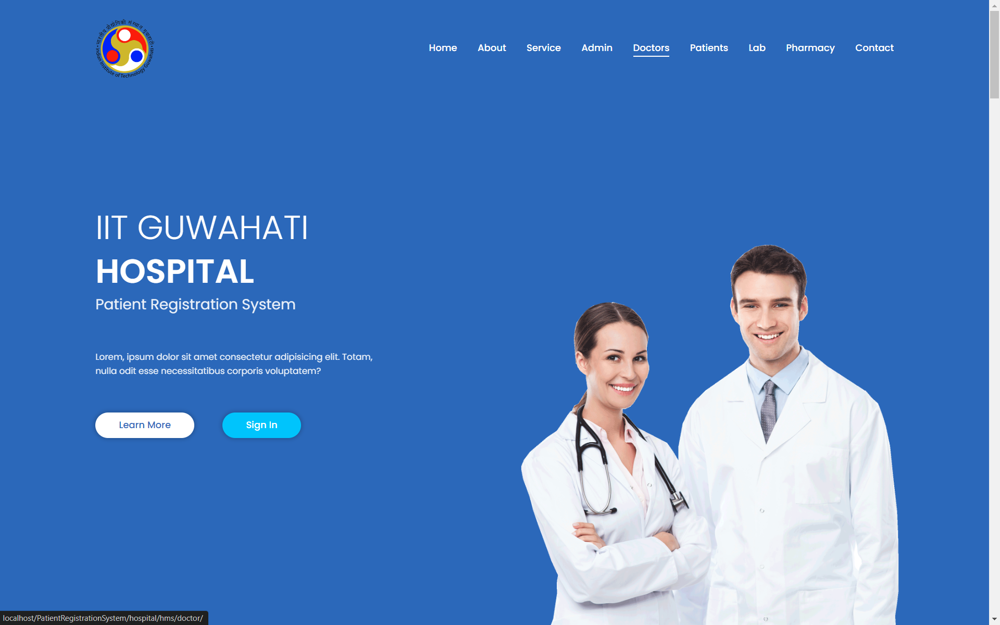
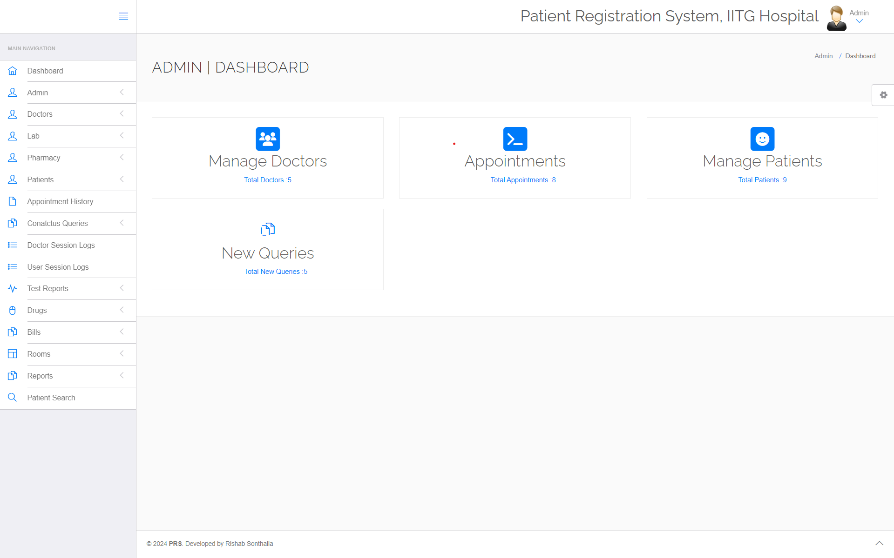
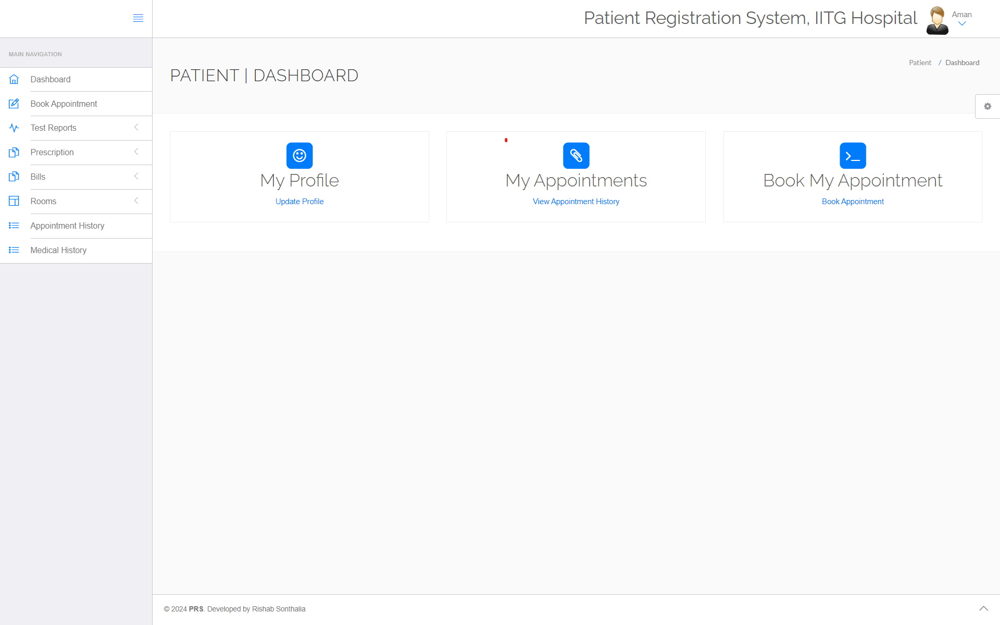
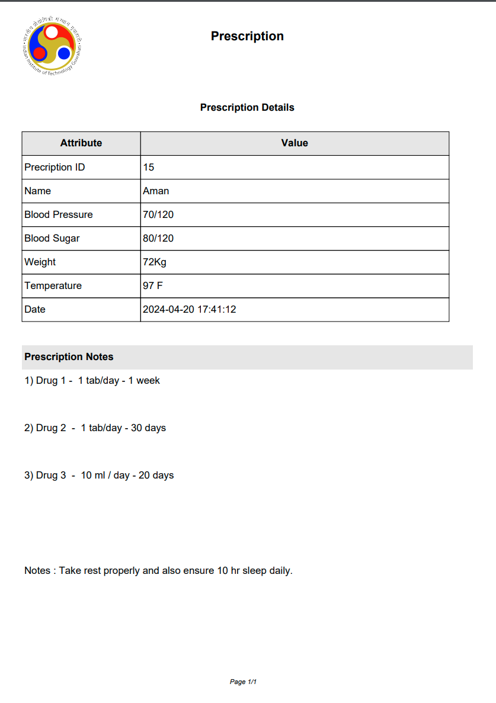

# Patient Registration System - IIT Guwahati Hospital

The Patient Registration System for IIT Guwahati Hospital is designed to streamline the registration process for patients, doctors, and administrators. This comprehensive system facilitates easy management of patient records, doctor schedules, and administrative tasks.

## Screenshots

### Home Page


### Admin Dashboard


### Patient Dashboard


### Prescription



## Features of the Patient Registration System - IIT Guwahati Hospital

The Patient Registration System for IIT Guwahati Hospital incorporates a variety of features designed to streamline the operational efficiency of hospital management, enhance the patient care process, and facilitate administrative tasks.

### Core Features

#### Patient Management
- **Comprehensive Patient Registration**: Patients can be registered with detailed personal information, medical history, and insurance details.
- **Medical History Tracking**: Medical histories, including past diagnoses and treatments, are meticulously recorded and easily accessible.

#### Appointment Scheduling
- **Doctor Specialization and Scheduling**: Patients can book appointments based on doctor specialization. Appointments include details like consultancy fees, dates, and times.
- **Automated Appointment Status Updates**: Both doctors and patients receive updates on appointment statuses, ensuring clear communication.

#### Doctor Management
- **Doctor Profiles**: Detailed profiles for doctors, including specialization, contact information, and consultation fees.
- **Schedule Management**: Doctors can manage their appointment schedules and view patient information ahead of visits.

#### Billing and Financial Management
- **Automated Billing**: Generation of bills with detailed charges, including room, medication, and consultation fees.
- **Insurance Handling**: The system manages insurance amounts and calculates the amount to be paid after insurance contributions.

#### Prescription and Medication Management
- **Drug Inventory**: Management of drug categories and inventories, including detailed descriptions and pricing.
- **Prescription Access**: Patients have access to their prescriptions, enhancing medication adherence.

#### Rooms Management
- **Room Allocation and Management**: Details of hospital rooms, including type, capacity, rent, and availability, are efficiently managed.

#### Reports and Test Results
- **Diagnostic Reports**: Patients and doctors can access diagnostic test reports, which include comprehensive results and notes.

#### System Access and Security
- **User Authentication**: Secure login mechanisms for administrators, doctors, and patients with role-based access control.
- **Activity Logging**: Detailed logs of user activity, including logins and actions performed within the system.

#### Communication
- **Contact and Feedback System**: A platform for patients to leave feedback or contact hospital administration, facilitating improved service delivery.

#### Laboratory Services
- **Lab Test Management**: Efficient management of laboratory tests and results. Laboratories can log in, manage tests, and upload results for access by doctors and patients.
- **Real-Time Test Status Updates**: Both laboratory technicians and patients receive real-time updates on test status, enhancing communication and efficiency.

#### Pharmacy Services
- **Pharmacy Inventory Management**: Detailed management of pharmacy inventory, ensuring drugs are stocked, tracked, and dispensed accurately.
- **Drug Dispensing and Billing**: Integration of pharmacy services with billing, providing a seamless experience for managing prescriptions and drug dispensing.

### Technical Specifications

- **Responsive Design**: The system is accessible across various devices, offering a consistent user experience.
- **Security Measures**: Advanced security protocols to protect patient data and ensure privacy compliance.

## Getting Started

This system is designed for easy setup and use. Follow the installation instructions to get started with improving your hospital's operational efficiency and patient care services.

### Prerequisites

- XAMPP/WAMP/LAMP server
- PHPMyAdmin
- Web browser

### Installation

1. **Download or Clone the Project**:
   - **Download**: Download the zip file of the project to your local machine and extract it.
   - **Clone**: Alternatively, clone the repository using the following command:
     ```sh
     git clone https://github.com/Sau-rav99/Patient-Registration-System
     ```

2. **Extract the Project** (if downloaded as a zip):
   Extract the downloaded zip file and copy the project folder.

3. **Place the Project in Your Web Server's Root Directory**:
   - For XAMPP, move the folder to `xampp/htdocs`.
   - For WAMP, move the folder to `wamp/www`.
   - For LAMP, move the folder to `var/www/html`.

4. **Set Up the Database**:
   - Activate the XAMPP.
   - Open PHPMyAdmin by visiting `http://localhost/phpmyadmin` in your web browser.
   - Create a new database named `hms`.
   - Import the `hms.sql` file provided within the zip package's `SQL file` folder into the newly created database.

5. **Launch the Application**:
   Open your web browser and navigate to `http://localhost/<your_folder_name>/hospital` to access the frontend of the Patient Registration System.

## Login Details

Access the system using the following login credentials:

| Role     | Email            | Password   |
|----------|------------------|------------|
| Admin    | admin@gmail.com  | admin@12345|
| Doctor   | ramu@gmail.com   | 123456     |
| Patient  | aman@gmail.com   | 1234567    |
| Lab      | aman@gmail.com   | 123456789  |
| Pharmacy | pharma@gmail.com | 1234567    |

## 🤝 Collaboration

We welcome contributions from the community! Here’s how you can get involved:

1. **Fork the Repository**: Click the "Fork" button on the top right to get a copy of the repository.
2. **Clone Your Fork**: Use `git clone <your-fork-url>` to clone your forked repository to your local machine.
3. **Create a Branch**: Use `git checkout -b feature-name` to create a new branch.
4. **Make Changes**: Implement your changes and commit them with clear and descriptive messages.
5. **Push Your Changes**: Use `git push origin feature-name` to push your changes to your fork.
6. **Create a Pull Request**: Go to the original repository and create a pull request, describing your changes and the reasons for them.
   
## Developer

**Name**: Saurav Das  
**Roll No.**: 220103099
**Name**: Ritik Kumar   
**Roll No.**: 220107105

